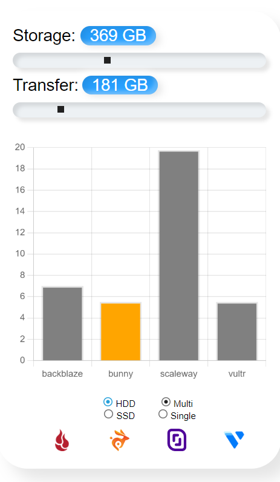
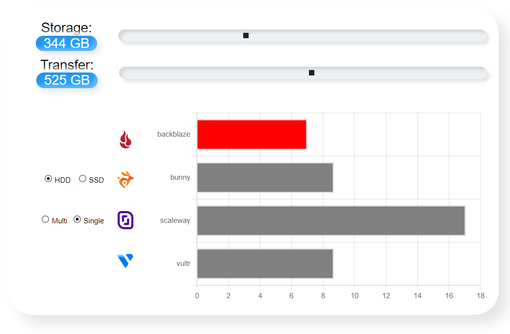
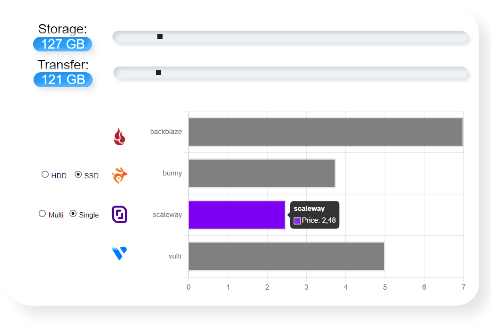

Read in [English](./README.en.md).

# Калькулятор порівняння цін провайдерів

Жива сторінка [тут](https://veronikanos.github.io/price-calculator/).

## Вирішенні наступні задачі:

1. Порівняння цін різних провайдерів. Ціни та провайдери надані технічним
   завданням.
2. Графік вертикальний для широких екранів та горизонтальний для вузьких.
   Для відмальовки графіку була використана бібліотека Chart.js.
3. Дві шкали Storage і Transfer у GB, з кроком в 1 GB та діапазоном від 0 до
   1000 GB. Реалізовано за допомогою інпутів типу range.
4. Додані іконки провайдерів.
5. Стовпчик з найнижчою ціною кольору провайдера (червоний, оранжевий,
   фіолетовий, блакитний). Інші стовпчики сірі.

Завдання написано на JavaScript. Для збірки проекту використано Parcel,
стилізовано за допомогою scss. Для відображення графіку використана бібліотека
Chart.js. Для оптимізації перемальовки графіку - бібліотека lodash.debounce.

### Вигляд на вузьких екранах (до 768px)

### Вигляд на широких екранах (від 768px)

